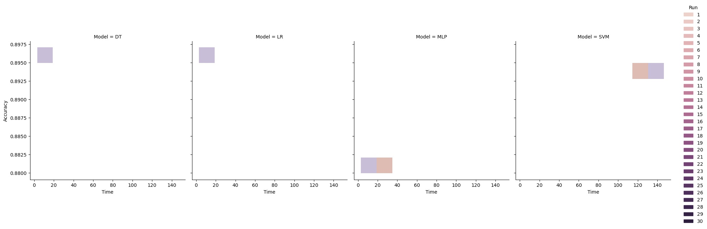

## Performace comparation
In this section, we will compare the performance of four different algorithms.
- Linear regression (LR)
- Decision tree (DT)
- Multi layer perceptron (MLP)
- Support vector machine (SVM)

All this algorithms are based on the same dataset and implemented in the same way using apache spark native implementation.

For the purpose of this analysis, we will use the following dataset: https://archive.ics.uci.edu/ml/datasets/Bank+Marketing about the bank marketing results.

Finally, we will compare the performance of the four algorithms based on the following metrics:
- Accuracy
- Run time

The code generated by this project is the following (file [test.scala](test.scala)):
```scala
import org.apache.spark.mllib.evaluation.MulticlassMetrics
import org.apache.spark.ml.classification.LogisticRegression
import org.apache.spark.sql.SparkSession
import org.apache.spark.ml.feature.VectorAssembler
import org.apache.spark.ml.linalg.Vectors
import org.apache.spark.ml.Pipeline
import org.apache.spark.ml.feature.{StringIndexer, OneHotEncoder}
import org.apache.spark.rdd.RDD
import org.apache.spark.sql.{Dataset, Row}
import org.apache.spark.ml.PipelineModel
import org.apache.spark.ml.classification.LinearSVC
import org.apache.spark.ml.classification.DecisionTreeClassifier
import org.apache.spark.ml.classification.MultilayerPerceptronClassifier
```

Reducing errors with this settings
```scala
import org.apache.log4j._
Logger.getLogger("org").setLevel(Level.ERROR)
```

Importing Spark session
```scala
val spark = SparkSession.builder().getOrCreate()

print("\n\nReading data ...\n")
```
Loading Data
```scala
val data  = spark.read.
    option("header","true").
    option("inferSchema", "true").
    option("delimiter", ";").
    csv("data/bank-full.csv").
    withColumnRenamed("y","label")

print("\n\nPreprocessing ...\n")
```
Categorical features
```scala
val categories = data.
    schema.
    filter(cl => cl.name != "label").
    filter(cl => cl.dataType.typeName == "string")

val encodedCategories = categories.flatMap(c => {
    val indexer = new StringIndexer().
        setInputCol(c.name).
        setOutputCol(c.name + "_indexed")

    // val encoder = new OneHotEncoder().
    //     setInputCol(c.name + "_indexed").
    //     setOutputCol(c.name + "_encoded")
    // Array(indexer, encoder)
    Array(indexer)
}).toArray

val labelIndexer = new StringIndexer().
    setInputCol("label").
    setOutputCol("label_indexed")

print("\n\nCreating pipeline ...\n")
val features_names = data.
    columns.
    filter(c=> c!="label").
    // map(c=> if (categories.map(c=>c.name) contains c) c + "_encoded" else c)
    map(c=> if (categories.map(c=>c.name) contains c) c + "_indexed" else c)
```


Encode data with VectorAssembler
```scala
val assembler = new VectorAssembler().
    setInputCols(features_names).
    setOutputCol("features")
```

Preprosessing pipeline
```scala
val pipeline = new Pipeline().
    setStages(
        encodedCategories ++
        Array(labelIndexer, assembler)
    )
```

Preprocessing data
```scala
val finalData = pipeline.fit(data).transform(data)
```

Split data into training and testing set
```scala
val Array(training, test) = finalData.randomSplit(Array(0.7, 0.3))
```


### LR model
```scala
def getLinerRegression() = {
    new Pipeline().setStages(Array(
        new LogisticRegression().
            setLabelCol("label_indexed")
    ))
}
```
### SVM model
```scala
def getSVM() = {
    new Pipeline().setStages(Array(
        new LinearSVC().
            setLabelCol("label_indexed")
    ))
}
```
### DecisionTree model
```scala
def getDecisionTree() = {
    new Pipeline().setStages(Array(
        new DecisionTreeClassifier().
            setLabelCol("label_indexed")
    ))
}
```
### Multi layer perceptron model
```scala
def getMLP() = {
    val layers = Array[Int](16, 8, 2)

    new Pipeline().setStages(Array(
        new MultilayerPerceptronClassifier().
            setLabelCol("label_indexed").
            setLayers(layers).
            setBlockSize(128).
            setMaxIter(100)
    ))
}
```


Get the predictions for the test set
```scala
def predict(model: PipelineModel, test: Dataset[Row]) = {
    model.transform(test).
        select($"prediction",$"label_indexed").
        as[(Double, Double)].
        rdd
}

def measure(predictions: RDD[(Double, Double)]) = {
    val metrics = new MulticlassMetrics(predictions)
    metrics.accuracy
}

def iterateModel(model: () => Pipeline, trainData: Dataset[Row], testData: Dataset[Row]) = {
    measure(
        predict(
            model().fit(trainData),
            testData
        )
    )
}
```


Evaluate models and collect elapsed time and results
```scala
val models: Seq[(String, () => Pipeline)] = Seq(
    ("LR", getLinerRegression),
    ("SVM", getSVM),
    ("DT", getDecisionTree),
    ("MLP", getMLP)
)
val runsPerModel = 30

for ((modelName, model) <- models) {
    print("\n\nTraining model: " + modelName + "\n")
    val times = (1 to runsPerModel).map { i =>
        val start = System.nanoTime()
        val acc = iterateModel(model, training, test)
        val end = System.nanoTime()
        (i, (end - start) / 1e9d, acc)
    }
    val timesDF = spark.createDataFrame(times).toDF("Run", "Time", "Accuracy")
    timesDF.
        write.
        mode("overwrite").
        option("header", "true").
        csv(s"data/times/${modelName}")
}
```
### Final results
